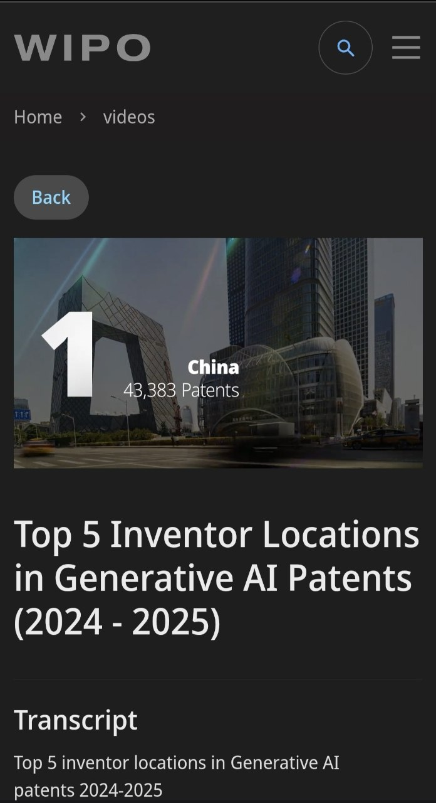
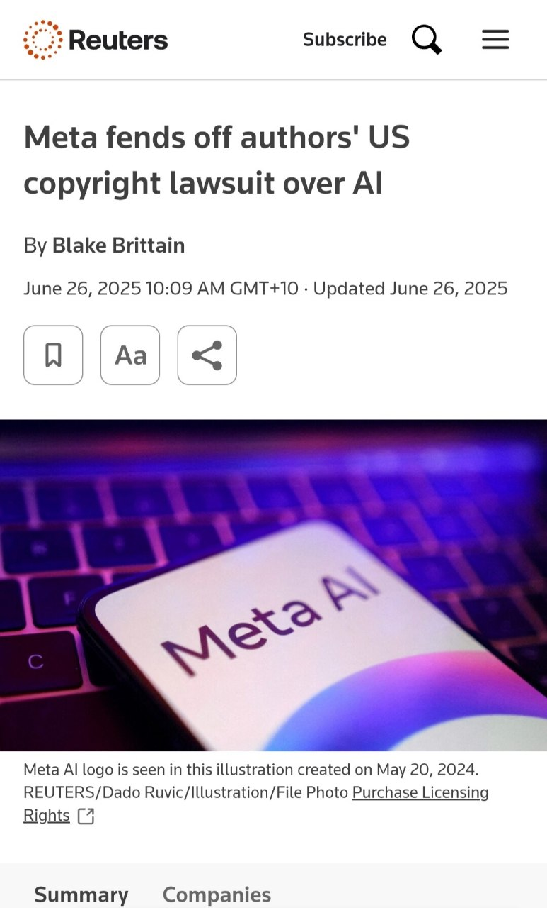
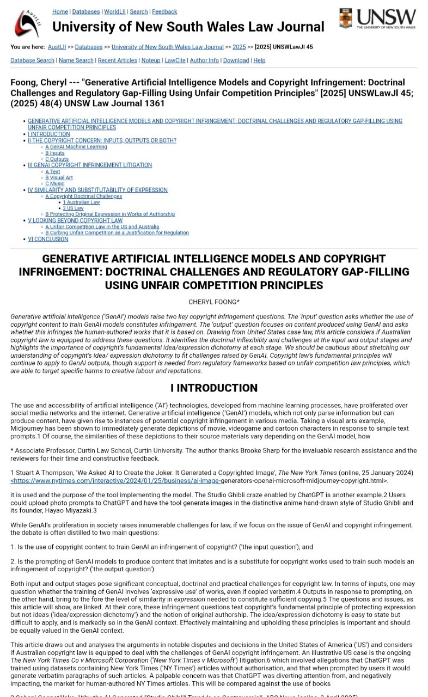

# e-portfolio-3-Intellectual-Property

A collection of artefacts that demonstrate what I have learnt about Intellectual Property (IP) and its importance in ICT.

## Artefact 1: WIPO – Generative AI Patent Trends in 2025

https://www.wipo.int/en/web/patent-analytics/generative-ai/2025

### Summary of the artefact
According to the World Intellectual Property Organization (WIPO), the number of generative AI inventions rose from 18,862 in 2024 to 37,808 in 2025 (WIPO 2026). Additionally, large language models emerged as the top category for generative AI models when measured based on patent volumes. Finally, China retained its position as the top origin of GenAI patent families.

### Justification on why I chose the artefact

I selected this artefact since I was able to learn that intellectual property involves other aspects such as patents which are vital in ICT. For instance, there has been massive patenting of GenAI indicating the rapid development of technology by technology firms.
In addition, during our workshop on the topic, we were presented with various ways through which ICT professionals create and utilise digital technologies that possess values to different organisation and society (Krause et al., 2019). Initially, before going through this report, I associated AI to mainly consist of softwares and data but after reading the report, I am conversant with concepts involving innovations leading to creation of Intellectual Property which need to be acknowledged and safeguarded. It is essential for me as an ICT student as my future career might entail developing technologies that have commercial and legal significance.

## Artefact 2: Reuters – Meta Copyright Case and AI Training

https://www.reuters.com/sustainability/boards-policy-regulation/meta-fends-off-authors-us-copyright-lawsuit-over-ai-2025-06-25/

### Summary of the artefact
A Reuters article from this year discusses a recent ruling in a US copyright case between Meta and a group of authors. In his ruling, a judge found in Meta’s favour as the authors did not provide sufficient evidence to demonstrate market harm as required but simultaneously emphasized that “this decision does not imply that utilizing copyrighted works for training artificial intelligence systems is automatically lawful” (Brittain 2025).

### Justification on why I chose the artefact

One reason for selecting this article was to see how challenging issues related to copyright could be if artificial intelligence (AI) systems were being trained up on existing pieces of creative work.
What really struck me was the fact that while there had been some indication that the decision would allow AI companies to utilise copyrighted material without restriction, the specific circumstances and evidence surrounding this case proved key.
This contradicted my initial assumption that these kinds of cases would have relatively straightforward solutions relating to copyright laws and their intersection with technologies – an issue we explored within our unit. 
In addition to that, given its relevance to my potential future career, having an awareness of these kinds of considerations around intellectual property and the importance placed upon the rights of those who create content is essential – especially since many software/AI projects will require access to huge volumes of information created by others. Thus, ensuring that all appropriate legal/ethical considerations have been considered prior to utilising such material is vital to practising responsibly as an ICT professional.

## Artefact 3: Scholarly Article – Generative AI and Australian Copyright

https://classic.austlii.edu.au/au/journals/UNSWLawJl/2025/45.html

### Summary of the artefact

Foong (2025) examines copyright infringement issues created by generative AI. The article explains two important questions. The first is whether copyrighted material used to train an AI model can create copyright infringement. The second is whether content generated by an AI system can infringe existing human-authored works. The article considers whether Australian copyright law is equipped to deal with these issues (Foong 2025, p. 1361).

### Justification on why I chose the artefact

I chose this scholarly article because it is directly relevant to Australia and helped me move beyond simply describing IP problems. I found the distinction between AI inputs and outputs useful because I had previously thought mainly about whether an AI-generated image or text copies someone else's work. The article made me realise that copyright questions can also begin earlier, when material is collected and used to train an AI model. This connects with the reflective writing approach in this unit because I had to examine how my original understanding changed after reading the source. I now think ICT professionals need to consider where data comes from, how it is used and whether permission or another legal basis exists. This will influence how carefully I approach data and software in future ICT work.

## Artefact 4: Workshop Personal Reflection

**Workshop evidence:**  
**Week:** 7  
**Date:** 6 September 2026  
**Tutor:** [INSERT YOUR REAL TUTOR NAME]  
**Campus/Online:** [INSERT YOUR REAL CAMPUS OR ONLINE]

**Insert your Week 7 workshop selfie here. The photo should show you attending the workshop and, where possible, include the tutor, lecture slides or another feature confirming attendance.**

### Summary of the artefact: My Personal Reflection

The Week 7 workshop focused on Intellectual Property and how ICT professionals need to recognise and respect ownership of digital work. The activity that stood out to me was thinking about how copyright, patents and other forms of IP can be affected by modern technologies such as AI and software.

### Justification on why I chose the artefact

I chose my workshop reflection because it is personal evidence of how my understanding developed rather than only evidence from an online source. Before this topic, I mainly thought of intellectual property as something related to copying books, images or software. The workshop helped me see that IP is also connected with innovation, ownership, licensing and professional responsibility. This was a positive learning experience because it made the topic more relevant to my future ICT career. I now understand that being an ICT professional is not only about making technology work; I also need to consider whether the information, code or other material I use belongs to someone else and whether I have permission to use it. This will encourage me to check licences and sources more carefully.

## References

Brittain, B 2025, 'Meta fends off authors' US copyright lawsuit over AI', Reuters, 26 June, viewed 6 September 2026, <https://www.reuters.com/sustainability/boards-policy-regulation/meta-fends-off-authors-us-copyright-lawsuit-over-ai-2025-06-25/>.

Foong, C 2025, 'Generative artificial intelligence models and copyright infringement: Doctrinal challenges and regulatory gap-filling using unfair competition principles', *UNSW Law Journal*, vol. 48, no. 4, pp. 1361–1390, viewed 6 September 2026, <https://classic.austlii.edu.au/au/journals/UNSWLawJl/2025/45.html>.

World Intellectual Property Organization 2026, 'Top Generative AI Patent Trends in 2025', WIPO, viewed 6 September 2026, <https://www.wipo.int/en/web/patent-analytics/generative-ai/2025>.

## AI Planning Statement

AI tools were used during the planning and research stage to help identify possible current artefacts and organise ideas. I checked the information against the original sources and refined the reflections in my own words. I used the unit's reflective writing guide to focus on analysis and evaluation rather than only description.
